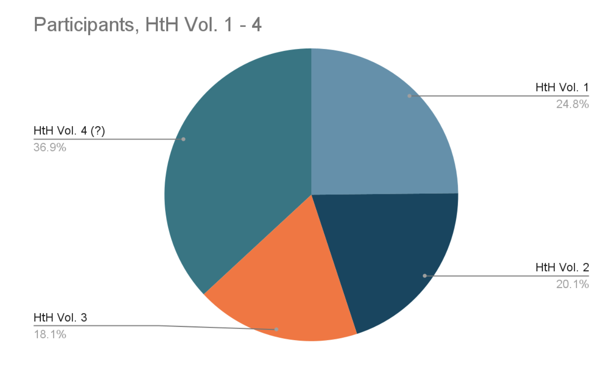
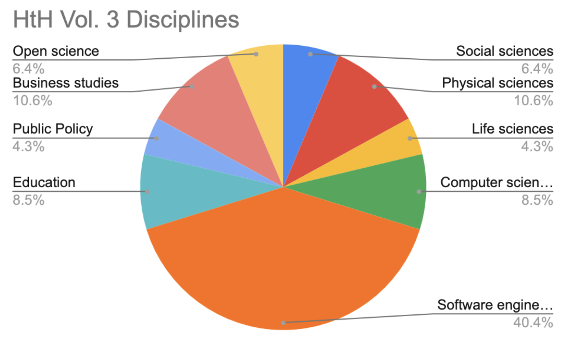

<!--
.. title: Community
.. slug: community
.. date: 2024-11-21 19:32:05 UTC
.. tags: 
.. category: 
.. link: 
.. description: 
.. type: text
-->

<!-- Community section -->
<section class="py-5 bg-light" style="margin-bottom: 3rem;">
    

        

            

                
            

            

                <h2>Participation</h2>
                

                    Hack the Hackathon events have so far attracted the participation of over 150 in-person, online an hybrid participants representing institutions from across the globe. 
                

                <a href="/join-us/index.html" 
                    style="color: #ff0123; 
                           text-decoration: none; 
                           font-weight: bold; 
                           border: 2px solid #ff0123; 
                           padding: 5px 10px; 
                           display: inline-block; 
                           transition: background-color 0.3s ease, color 0.3s ease;" 
                    onmouseover="this.style.backgroundColor='#333333'; this.style.color='white'; this.style.cursor='pointer';" 
                    onmouseout="this.style.backgroundColor='transparent'; this.style.color='#ff0123';">
                    Join the Community
                 </a>
            

        

    

</section>

<!-- Our Story Section -->
<section class="py-5" id="story" style="margin-bottom: 3rem;">
    

        

            

                <h2>Interdisciplinarity</h2>
                

                    Hack the Hackaton brings together participants from a wide range of disciplines including the physical, life and social sciences, education, public policy, business and software engineering. 
                

            

            

                
            

        

    

</section>